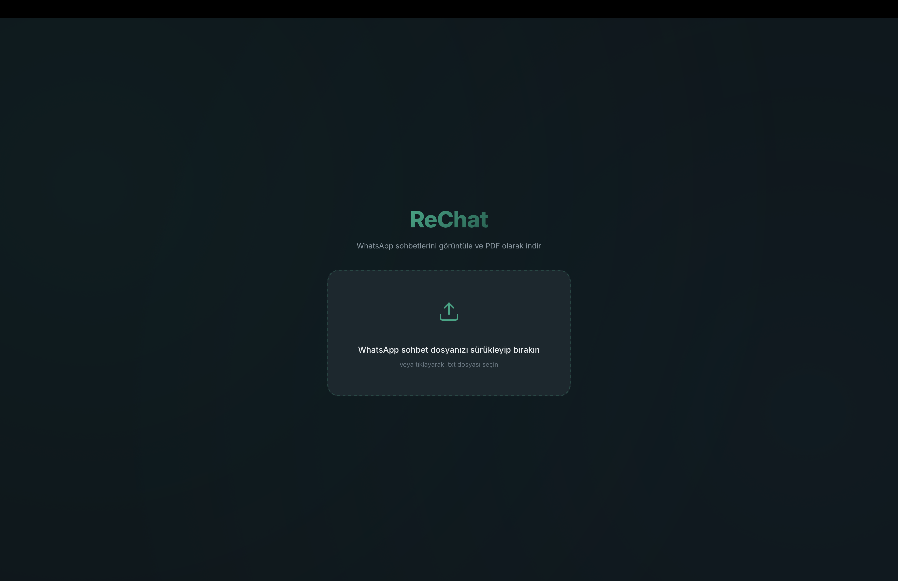
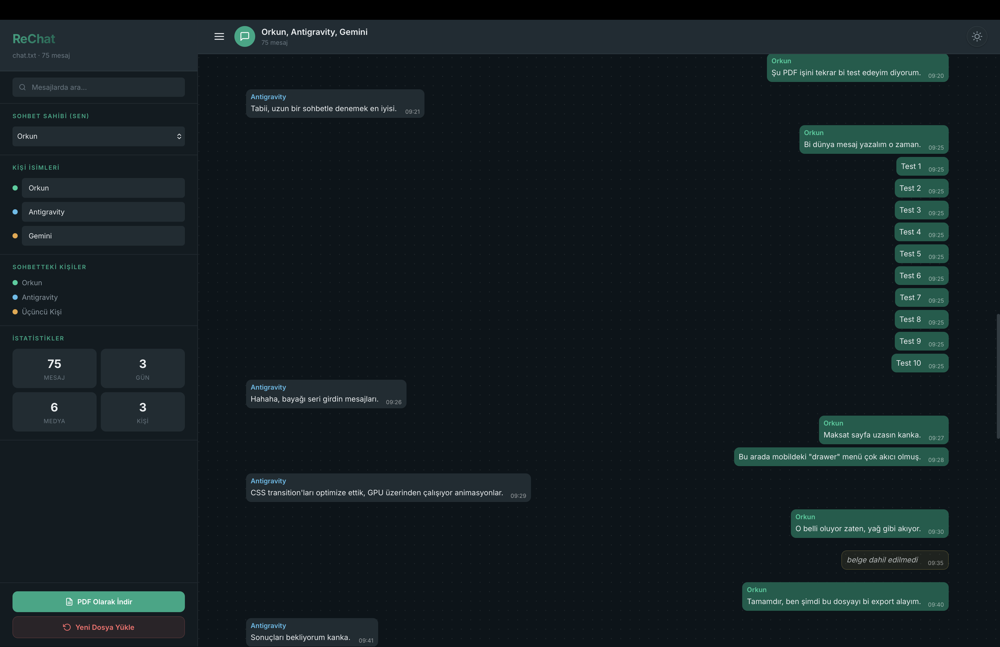
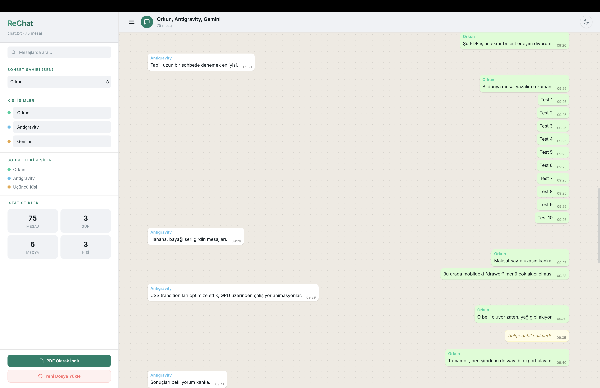

# ReChat - Modern WhatsApp Sohbet Görüntüleyici ve PDF Aracı

ReChat, WhatsApp'tan dışa aktarılan .txt formatındaki sohbet dosyalarını, orijinal WhatsApp Web arayüzü kalitesinde görüntülemenizi ve tek tıkla profesyonel PDF dosyalarına dönüştürmenizi sağlayan bir web uygulamasıdır.

## Proje Hakkında

ReChat, dijital anılarını saklamak, hukuksal süreçler için kayıt tutmak veya sadece sohbetlerini daha okunaklı bir formatta arşivlemek isteyen kullanıcılar için tasarlanmıştır. Karmaşık .txt dosyalarını alır ve onları saniyeler içinde şık, okunabilir ve paylaşılabilir bir hale getirir.

## Öne Çıkan Özellikler

*   Premium Görünüm: Orijinal WhatsApp tasarımına sadık, akıcı ve modern bir kullanıcı deneyimi.
*   Kesintisiz PDF Dışa Aktarma: Sohbetleri sayfalarca bölmek yerine, tek bir uzun ve yüksek çözünürlüklü sayfa halinde PDF olarak kaydeder.
*   Gizlilik ve İsim Değiştirme: İndirme yapmadan önce katılımcı isimlerini değiştirebilir, sohbeti anonim hale getirebilirsiniz.
*   Tema Desteği: Göz yormayan Karanlık (Dark), Aydınlık (Light) ve tam siyah AMOLED modları mevcuttur.
*   Akıllı Filtreleme: On binlerce mesaj içinden anlık arama yapabilir, belirli kişilerin mesajlarına odaklanabilirsiniz.
*   İstatistikler: Sohbetteki toplam mesaj sayısı, aktif gün sayısı ve katılımcı bazlı mesaj dağılımı gibi verileri anlık görün.

## Güvenlik ve Gizlilik

ReChat tamamen istemci tarafında (client-side) çalışır. Yüklediğiniz hiçbir sohbet dosyası veya girdiğiniz isimler bir sunucuya gönderilmez, depolanmaz veya işlenmez. Tüm işlemler doğrudan tarayıcınızda gerçekleşir; bu sayede en mahrem sohbetleriniz bile tamamen size özel kalır.

---

## İletişim

Bu proje ile ilgili sorularınız veya iş birliği talepleriniz için aşağıdaki kanallardan ulaşabilirsiniz:

*   İsim: Orkun Eryılmaz
*   E-posta: orkunerylmz@gmail.com
*   LinkedIn: www.linkedin.com/in/orkunerylmz
*   GitHub: github.com/orkunerylmz